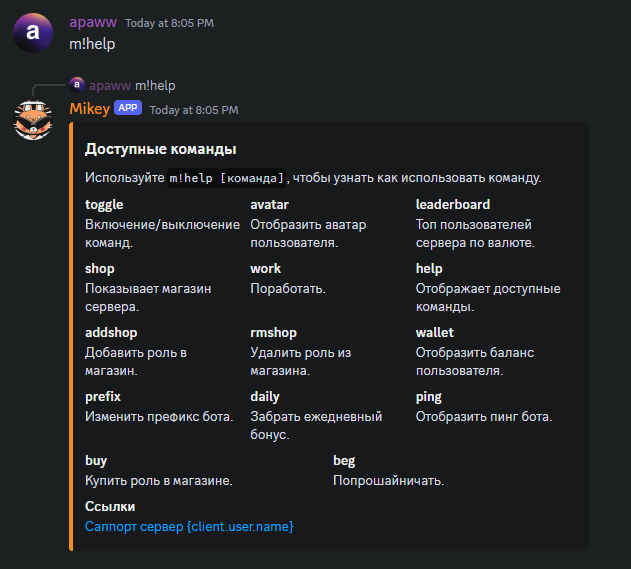
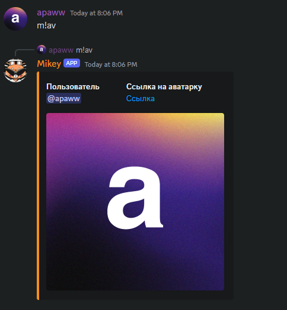
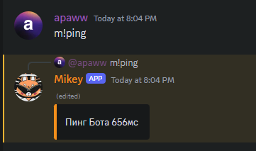
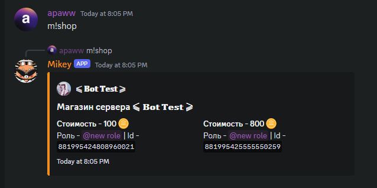
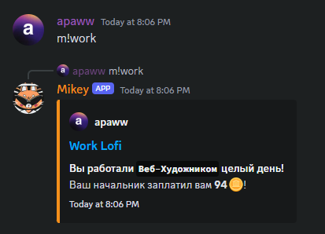

Проект по теме WebServer+API

# Mikey

```
Выполнил: Коканов Павел
Руководитель: Токаревская Светлана
```

---

## Цель проекта
Цель проекта заключается в создание Discord бота с экономической системой.

---

## Задачи
- Изучение принципов работы ботов на discord.py
- Разработка логики работы бота
- Создание бота
- Имплементация датабазы MongoDB в бота

---

## Структура проекта
- cogs - коги с классами команд
- config.json - конфиг бота
- functions.py - функции работы с датабазой
- mongo.py - создание соединения с датабазой и инициализация коллекций
- main.py - основной код бота
  
---

## Структура когов
`В каждом файле находится один класс с одной или несколькими командами (или ивентами)`
- addshop.py - команда для добавления роли в магазин сервера
- avatar.py - отображение аватара пользователя
- beg.py - попрошайничество (один из способов получния валюты)
- buy.py - покупка роли из магазина сервера
  
---

- daily.py - получение ежедневного бонуса валюты
- help.py - комнада с выводом помощи по использованию других команд
- leaderboard.py - вывод топа пользователей по валюте
- onCommandError.py - вывод ошибок выполнения команд пользователю
- ping.py - вывод информации о пинге бота

---

- removeshop.py - удаление роли с продажи
- shop.py - вывод магазина сервера
- toggle.py - выключение/включение команд на сервере
- wallet.py - вывод баланса пользователя
- work.py - работа (один из способов получния валюты)

---

## Общая структура классов
- классы являются дочерними от класса `discord.ext.commands.Cog`
- \_\_init\_\_ - принимает в себя объект класса `discord.ext.commands.Bot` (клиент)
- cog_load - при загрузке кога выводит сообщение в консоль
- команда/ивент

---

## Структура датабазы
- Датабаза mikey состоит из 4 коллекций
    - prefixes - хранит префиксы бота на разных серверах
    - wallets - хранит балансы пользователей
    - toggle - хранит выключенные команды на сервере
    - shops - хранит роли, продающиеся в магазинах серверов

---

# Примеры работы команд

---

### help

Вывод меню с доступными командами

---

### avatar

Отображение аватара пользователя

---

### ping

Отображение пинга бота

---

### shop

Вывод магазина сервера

---

### work

Вывод сообщения о работе

---

### Используемые библиотеки
```
- discord.py
- pymongo
- json
- random
- time
- os
- rich
```

---

### Реализуемые технологии
Бот на discord.py с использованием ООП, датабазой на MongoDB и хранением данных в json

---


# Спасибо за внимание!

Презентация сделана с помощью [Marp](https://marp.app)